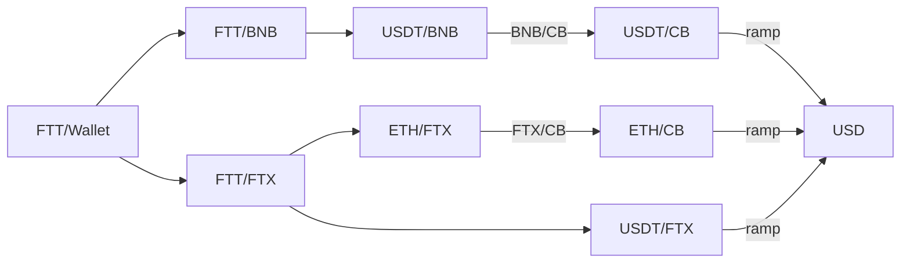

# The Principal Path Method

The landscape of digital assets and blockchain technology has rapidly evolved, introducing concepts such as smart contracts, stablecoins, tokens, non-fungible tokens (NFTs), and other web3 technologies. These advancements have expanded the definition of assets, markets, and economies. Digital assets are no longer limited to payment tokens or stores of value; they now encompass works of art, virtual real estate, and entertainment assets.

These new assets pose challenges for financial reporting, both conceptual and methodological. One such challenge is _fair value_ pricing, the standard required by US and international accounting standards (US GAAP and IFRS) for reporting value in financial reports.

Fair value pricing is a crucial aspect of the mark-to-market accounting method, which mandates that asset valuations in financial reporting should accurately reflect current market prices, with regular adjustments made to account for prevailing market conditions. Under this accounting standard, the value of an asset is determined by its price on a specified **_principal market_**, which is typically the exchange where the asset is officially listed and traded (e.g., NYSE, Nasdaq, CBOT). In other cases such as globally traded commodities or foreign exchange, the principal market is determined to bse the market with dominating volumes, e.g. EBS and Reuters for foreign exchange, ICE and NYMEX for oil. These markets are local to some geographic region and are active a limited number of hours a day. Assets are exchanged against a sovereign fiat currency, and apart from potential currency conversions, fair value is derived from the price of the most recent transactions on the designated principal market. This ensures that assets are reported at their current market values, providing transparency and accuracy in financial reporting.

In the universe of digital assets, trading is global and happens across many different venues without a specific venue dominating any of the others. Moreover, most transactions are swaps of digital assets against other digital assets, this is true even if one of these assets is a stablecoin. Even for assets that trade against fiat currencies it is often the case that a small fraction of the volume is converted to fiat (on/off ramping) while the real drivers are crypto to crypto swaps. With such fragmented markets, it becomes impossible to apply existing standards to reflect market realities.

The __Principal Path Method__ offers an alternative method in which a market is ephemerally designated as principal market and once that market is obtained, source all price information from that market. The identification is a continuous process driven by volumes, market dynamics and freshness of data.



<!-- APE_1667909760 -->
```mermaid
graph TD
  G["APE/wallet"] --> H["APE/FTX"]
  G -> E["APE/BNB"]
  G --> K["APE/CB"]
  E --> F["BUSD/BNB"]
  E -> J["USDT/BNB"]
  F --> A["ETH/BNB"]
  J -> A
  A --> B["ETH/BTS"]
  A -> L["ETH/FTX"]
  B --> C["USD/BTS"]
  L -> M["USDT/FTX"] 
  M --> I["USD/FTX"]
```

## The Principal Path Library
This
<!-- 
  H --> I
  K --> N["USD/CB"]
  N --> D["USD"]
  I --> D
-> 

