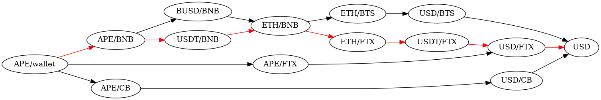

# The Principal Path Method

The landscape of digital assets and blockchain technology has rapidly evolved, introducing concepts such as smart contracts, stablecoins, tokens, non-fungible tokens (NFTs), and other web3 technologies. These advancements have expanded the definition of assets, markets, and economies. Digital assets are no longer limited to payment tokens or stores of value; they now encompass works of art, virtual real estate, and entertainment assets.

These new assets pose challenges for financial reporting, both conceptual and methodological. One such challenge is _fair value_ pricing, the standard required by US and international accounting standards (US GAAP and IFRS) for reporting value in financial reports.

Fair value pricing is a crucial aspect of the mark-to-market accounting method, which mandates that asset valuations in financial reporting should accurately reflect current market prices, with regular adjustments made to account for prevailing market conditions. Under this accounting standard, the value of an asset is determined by its price on a specified **_principal market_**, which is typically the exchange where the asset is officially listed and traded (e.g., NYSE, Nasdaq, CBOT). In other cases such as globally traded commodities or foreign exchange, the principal market is determined to be the market with dominating volumes, e.g. EBS and Reuters for foreign exchange, ICE and NYMEX for oil. These markets are local to some geographic region and are active a limited number of hours a day. Assets are exchanged against a sovereign fiat currency, and apart from potential currency conversions, fair value is derived from the price of the most recent transactions on the designated principal market. This ensures that assets are reported at their current market values, providing transparency and accuracy in financial reporting.

In the universe of digital assets, trading is global and happens across many different venues without a specific venue dominating any of the others. Moreover, most transactions are swaps of digital assets against other digital assets, this is true even if one of these assets is a stablecoin. Even for assets that trade against fiat currencies it is often the case that a small fraction of the volume is converted to fiat (on/off ramping) while the real drivers are crypto to crypto swaps. With such fragmented markets, it becomes impossible to apply existing standards to reflect market realities.

## The Principal Path Method

The __Principal Path Method__ (PPM) offers an alternative method for pricing assets in a cosistent and coherent manner that accounts for the unique structure of the market and in particular the diversity of assets that are used in it. 

It is well understood that if an asset does not trade directly against a USD or trades in very low volumes then it can be converted to USD indirectly through sequence of conversions going through multiple assets before reaching USD. It is also clear that there are many different sequences of assets that may be used, and the choice of the path impacts the price attained. The objective of PPM is to provide a methodology through which a path for pricing an asset is selected just as accounting guidelines provide a method trough which principal markets are chosen and used to price particular assets. However, due to the volatile nature of the the speed at which exchanges can raise to prominence on the one hand, and the rapid collapse on the other, it is important that the designation of principal path be dynamic and ephemeral and respond to changing market conditions. The objective is to provide a price that meets the basic requirements of fair value of _availability_ , _reliability_ and _relevance_. 

To illustrate, given assets like BTC, ETH, USDT, USDC, MANA, GLT, APE, etc., we define exchangeable pairs as those traded on compliant public markets with established exchange rates. A pair like (USDT, ETH) is exchangeable across multiple exchanges, while (DOGE, APE) is not. These assets and pairs form the exchangeability graph. A pricing path connects two assets, possibly across multiple exchanges and blockchains, considering fees, risks, and other factors. 
<figure>
  
  <figcaption>
    <small><em><strong>Figure 1</strong>: The APE - USD expandability graph on Tuesday, November 8, 2022 12:16:00</em></small>
  </figcaption>
</figure>

 <bf><bf>
PPM assigns a score to each path based on asset characteristics, exchange compliance, volumes, data freshness, transitions, and more. The path with the highest score becomes the ephemeral _principal path_ used for pricing the asset.

<!-- [APE_1667909760](figures/APE_1667909760.png) -->

## The Principal Path Library
This library 

